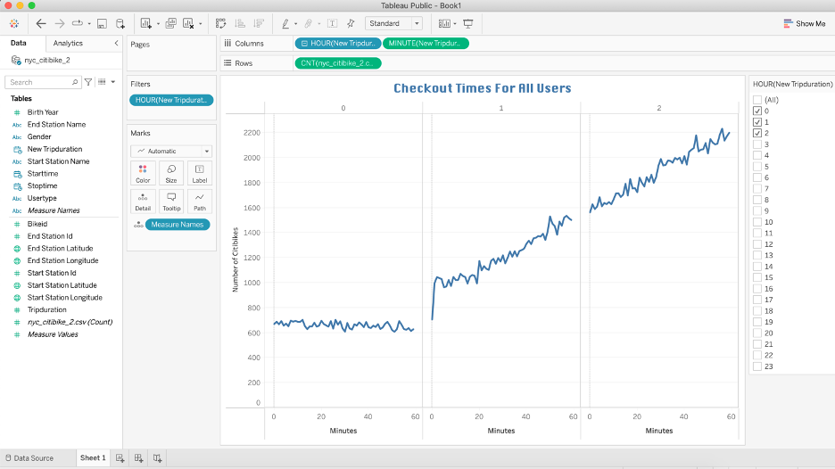
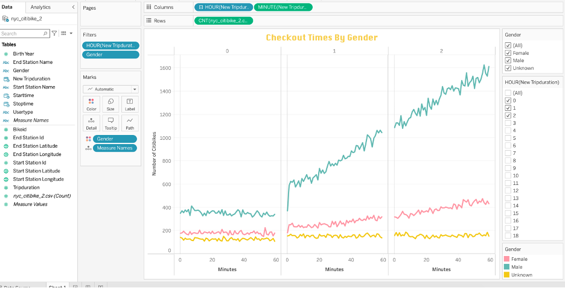
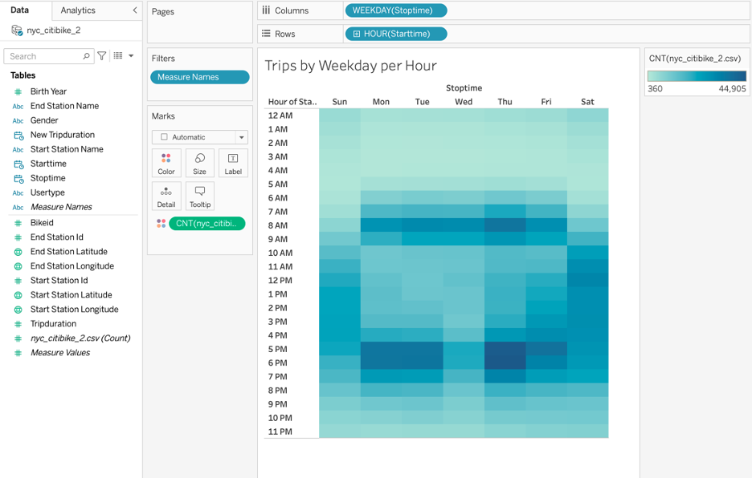
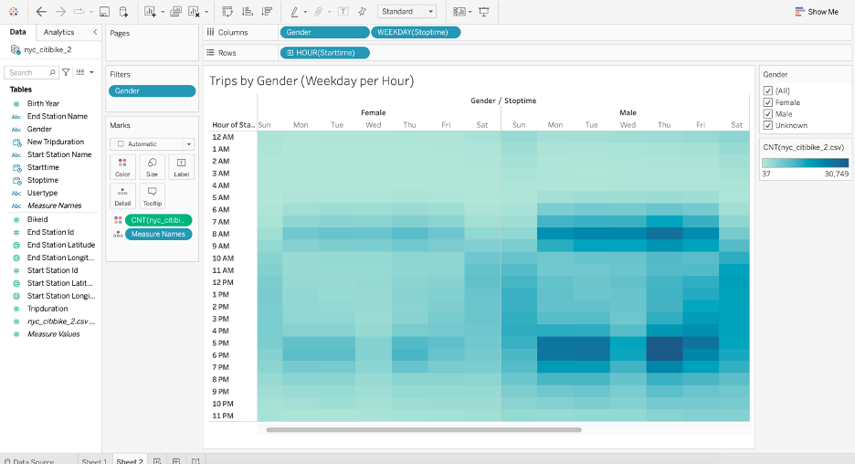
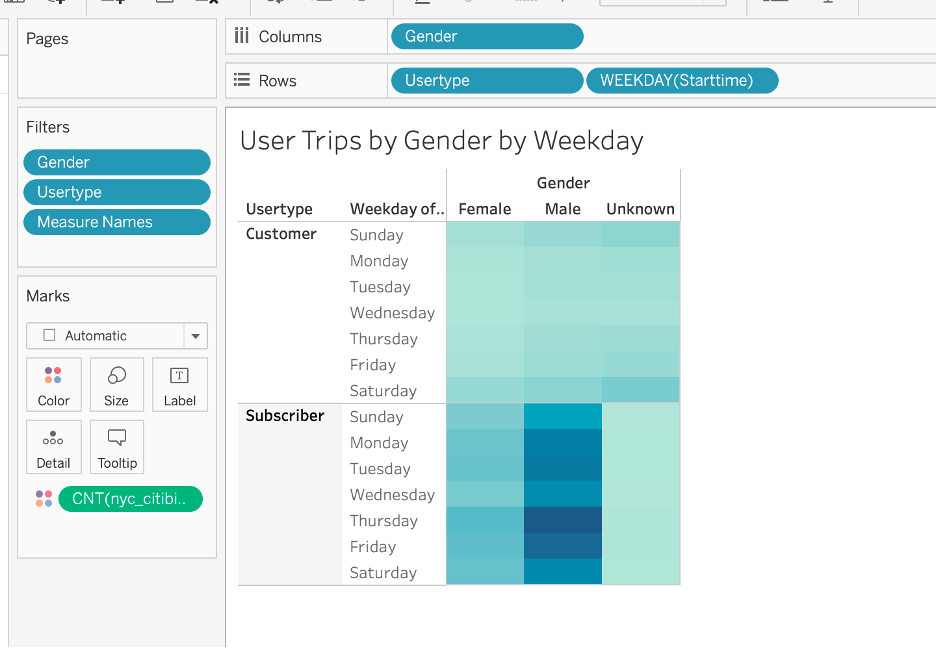
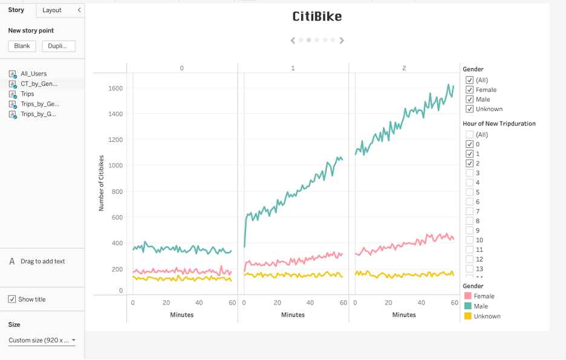
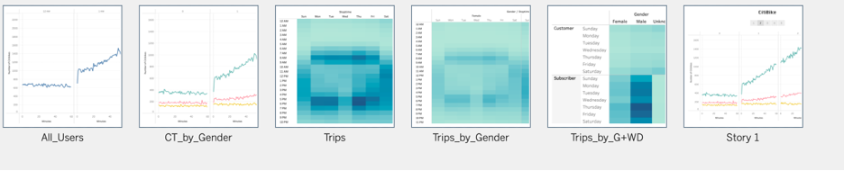
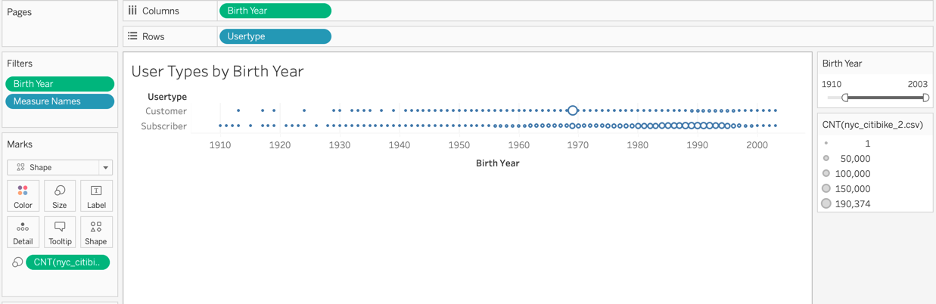
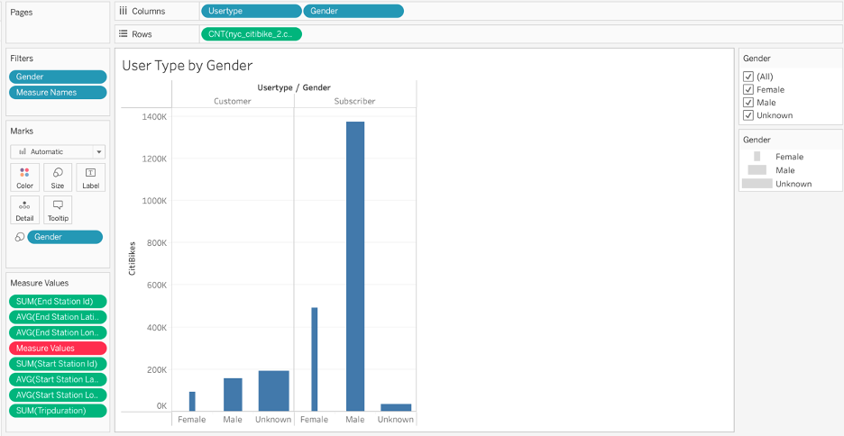

# CitiBike
### Purpose:

- Import data into Tableau.
- Create and style worksheets, dashboards, and stories in Tableau.
- Use Tableau worksheets to display data in a professional way.
- Portray data accurately using Tableau dashboards.

### Overview of the statistical analysis:

Des Moines requested data for a business proposal. Citibike data from NYC was reviewed by looking at geographical data as well as data disaggregated by user types and genders to determine if it would be a good investment for Des Moines. Other data points include usage durations, peak usage times, and the key target market.

### Cleaning the Data
Jupyter Notebook was used to clean the file for use:
- [Challenge File](NYC_CitiBike_Challenge.ipynb)

### Results of the NYC Citibikes Analysis:
Line graph displaying the number of bikes checked out by duration for all users, filtered by hour.

Line graph displaying the number of bikes that are checked out by duration for each gender by the hour, filtered by the hour and gender.

A heatmap showing the number of bike trips for each hour of each day of the week.

A heatmap showing the number of bike trips by gender for each hour of each day of the week, and the heatmap can be filtered by gender .

A heatmap showing the number of bike trips for each type of user and gender for each day of the week, and you can only filter by user and gender

Creating the Story:

### Additional User Type Analysis
Additional Data 1

Additional Data 2

